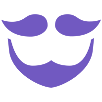
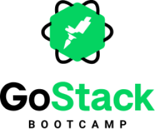

# GoBarber Backend api

<h1 align="center">
    
    
</h1>


## 📑About
This project is one application created in **Bootcamp GoStack**,for the purpose of recreating a **barber shop** application.

---

## 💻Technologies used

This project was developed using:

- TypeScript
- Yarn
- Patterns
- Eslint
- Prettier
- Styled Components
- axios

---

## 💾How clone and use this project ?

## **Obs: This project necessite the outher project: [gobarber_backend_api](https://github.com/TomasSantosz/gobarber_backend_api). Execute all configurates the outher  project necessite, continue after  conclued.**

```bash

    # Clone the repository
    $ git clone https://github.com/TomasSantosz/gobarber_frontend_web.git

    # Enter directory
    $ cd gobarber_frontend_web

    # Install dependencies
    $ yarn

```


---
## Routes
  #### Register:
  - **URL:** localhost:3000/signup

  #### Login:
  - **URL:** localhost:3000/

  #### Dashboard:
  - **URL:** localhost:3333/appointments
  - #### **Obs: This route requires login**


---

### Developer Tomás Santos
#### Github: https://github.com/TomasSantosz
#### LinkedIn: https://www.linkedin.com/in/tom%C3%A1s-santos-3b9617167/
